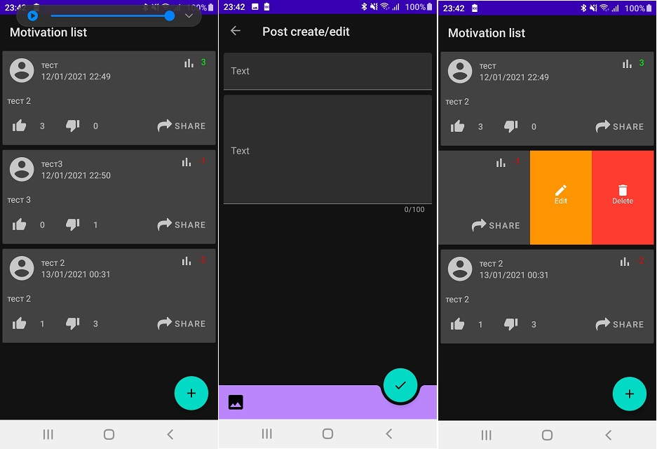

# «Motivation - приложение для мотивационных цитат и идей».
---

## Легенда

Приложение, позволяющее сохранять и просматривать советы, идеи, высказывания и заявления других людей, а, возможно, ваши собственные на вашем смартфоне. 
А также выставлять им рейтинг (повышать или понижать).

### Экран идей (картинка кликабельна)

Все идеи отсортированы по рейтингу.

У каждой идеи есть:
1. Автор
1. Дата публикации
1. Текст (максимальное количество символов - не более 100)
1. Изображение

Экран идей пролистывается вниз с подгрузкой более старых идей - по 20 шт.

Кликабельные элементы:
1. Автор - при клике на авторе происходит переход на страницу с точно таким же списком, но только с идеями этого автора
1. Кнопка одобрить (палец вверх)* - при клике добавляется одобрение пользователя для соответствующей идеи (рейтинг увеличивается на 1).
1. Кнопка не одобрить (палец вниз)* - при клике добавляется одобрение пользователя для соответствующей идеи (рейтинг уменьшается на 1).
1. Кнопка шаринга - шариться текст и автор цитаты + изображение (если есть)
1. Удаление и редактирование осуществляется через swipe menu в RecyclerView

После одобрения/не одобрения любой идеи карточки автоматически сортируются: те, у кого рейтинг выше, становятся наверх, у кого ниже - вниз.

### Хранение данных

Все данные хранятся в локальной базе данных, картинки приложения копируются в собственный каталог.
